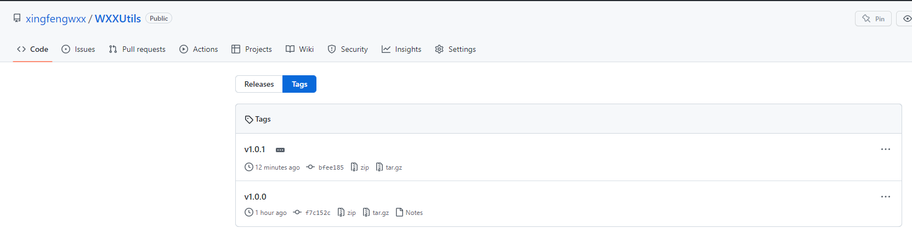
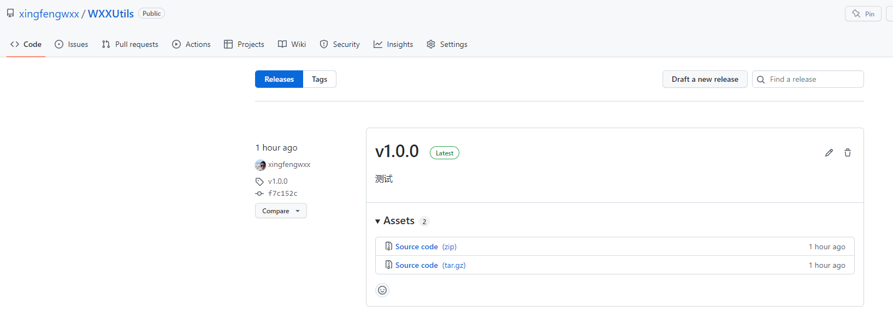
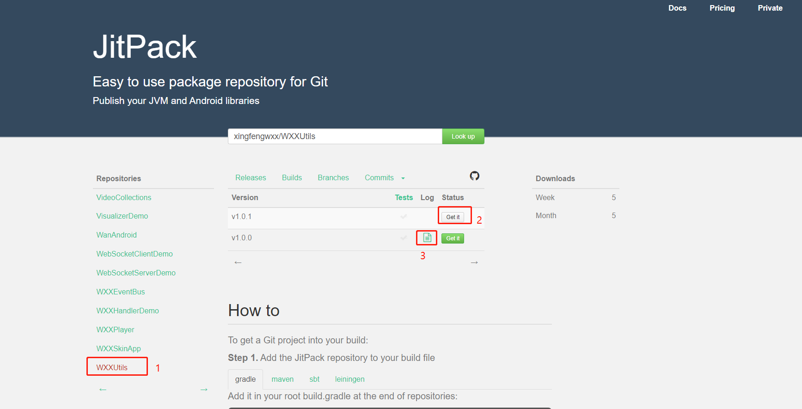

# 测试aar包上传到github

##### 1.在根目录下的build.gradle文件添加配置

```groovy
buildscript {
    repositories {
        mavenLocal()
        maven { url 'https://maven.aliyun.com/repository/central' }
        maven { url 'https://maven.aliyun.com/repository/public' }
        maven { url 'https://maven.aliyun.com/repository/google' }
        maven { url 'https://maven.aliyun.com/repository/gradle-plugin' }
        mavenCentral()
        gradlePluginPortal()
        maven { url 'https://jitpack.io' }
    }

    dependencies {
        classpath 'com.github.dcendents:android-maven-gradle-plugin:2.1'
    }
}
```

##### 2.在mylibrary项目下的build.gradle文件中的plugin{}添加配置

```groovy
 id 'maven-publish'
```

##### 3.在mylibrary项目下的build.gradle文件添加配置

```groovy
afterEvaluate {
    publishing {
        publications {
            // Creates a Maven publication called "release".
            release(MavenPublication) {
                // Applies the component for the release build variant.
                from components.release

                // You can then customize attributes of the publication as shown below.
                groupId = 'com.github.xingfengwxx'
                artifactId = 'mylibrary'
                version = '1.0.0'
            }
            // Creates a Maven publication called “debug”.
            debug(MavenPublication) {
                // Applies the component for the debug build variant.
                from components.debug

                groupId = 'com.github.xingfengwxx'
                artifactId = 'mylibrary'
                version = '1.0.0'
            }
        }
    }
}
```

##### 4.到github项目创建一个tag，然后创建一个release





##### 5.然后到jitpack官网操作，选择1处的仓库，点击2处的Get it,构建成功后出现3处的状态



##### 6.在项目中使用发布的aar包，在根项目的build.gradle文件中添加配置

```groovy
allprojects {
		repositories {
			...
			maven { url 'https://jitpack.io' }
		}
	}
```

##### 7.在app项目中的build.gradle文件中添加依赖

```
implementation 'com.github.xingfengwxx:WXXUtils:1.0.0'
```

